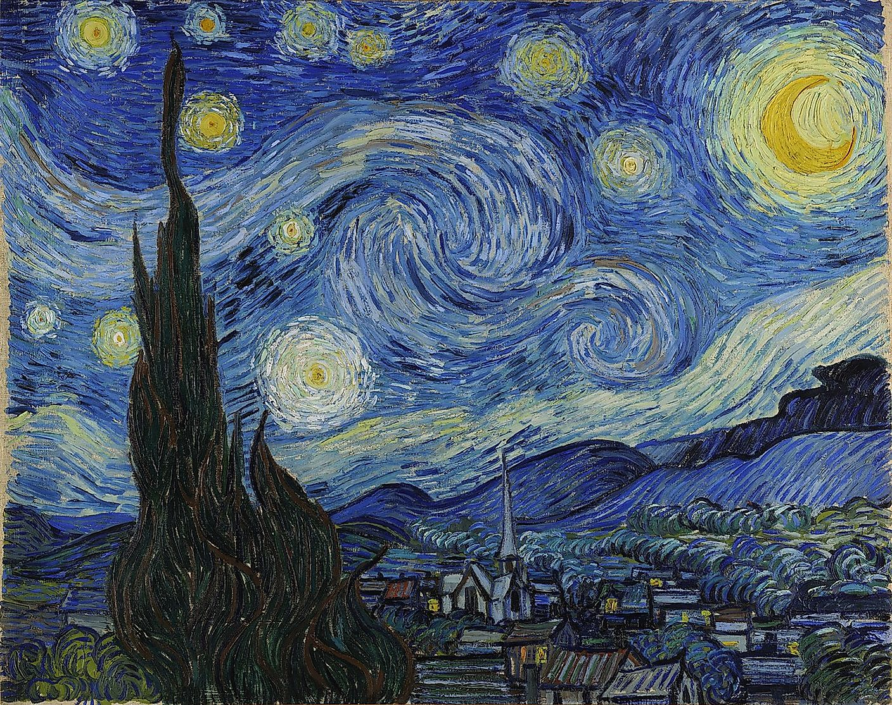
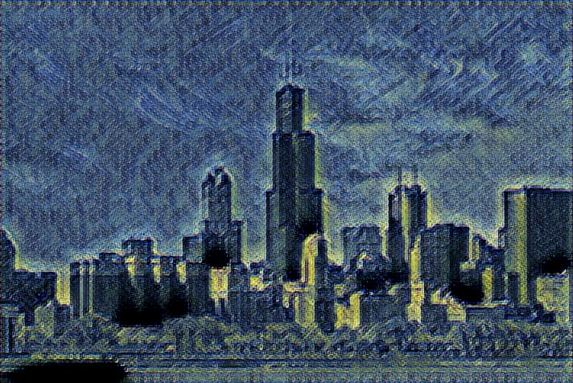

## Fast style transfer

Implemented using tensorflow functional API.

examples:

Style             |  Trained
:-------------------------:|:-------------------------:
  | 
  | 

After training to test the style on a new image

`python main.py --image <path-to-image>`
